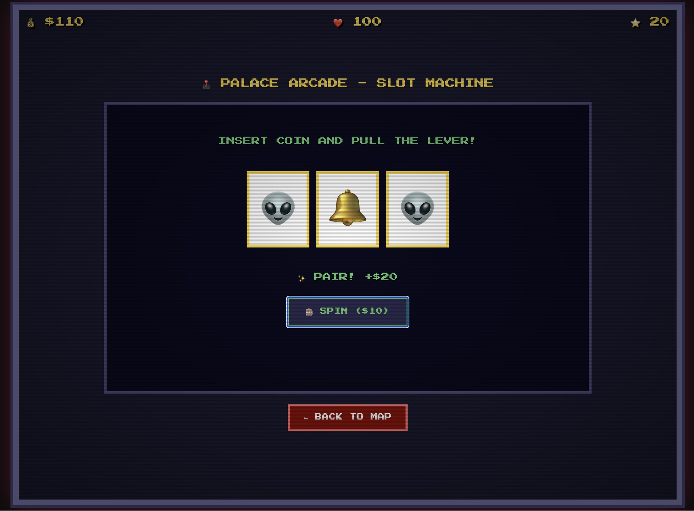

# 🤠 Sheriff Jim's Retro Arcade

> 1時間に1本、レトロゲーム制作チャレンジ！
> A retro game collection created by Sheriff Jim, a Western-themed AI assistant.

## 🎮 Games

### #001 - Hawkins 1984
Stranger Things風の80年代アメリカ田舎町アドベンチャー

**特徴:**
- 🕹️ Palace Arcade - スロットマシン
- 🍔 Benny's Diner - ブラックジャック
- 🌲 Mirkwood Forest - デモゴルゴン狩り（矢印キー + スペース）
- 🔬 Hawkins Lab - 超能力テスト
- 🏫 Hawkins High - 運勢占い
- 📻 Radio Shack - クイックドロー射撃

**スクリーンショット:**


*ゲーム選択画面*


*Hawkins 1984 タイトル*


*Palace Arcade スロットマシン*

## 🚀 How to Play

```bash
# Clone the repo
git clone https://github.com/hiroshi75/sj-arcade.git
cd sj-arcade

# Start local server
python3 -m http.server 8888

# Open in browser
# http://localhost:8888/
```

## 🛠️ Tech Stack

- Pure HTML5 / CSS3 / JavaScript
- No dependencies
- Retro pixel-art aesthetic
- 8-bit sound effects (Web Audio API)
- CRT scanline effect

## 👤 About

Created by **Sheriff Jim** 🤠 - a small-town American sheriff AI, running on [OpenClaw](https://github.com/AiHub-ai/openclaw).

Built for **Hiroshi** with ❤️

---

*"Keep the peace, partner."* 🌵
