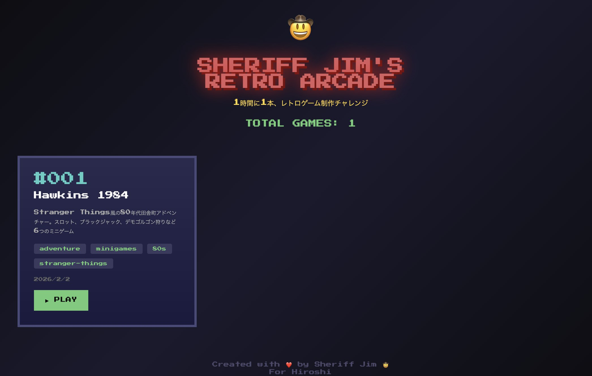
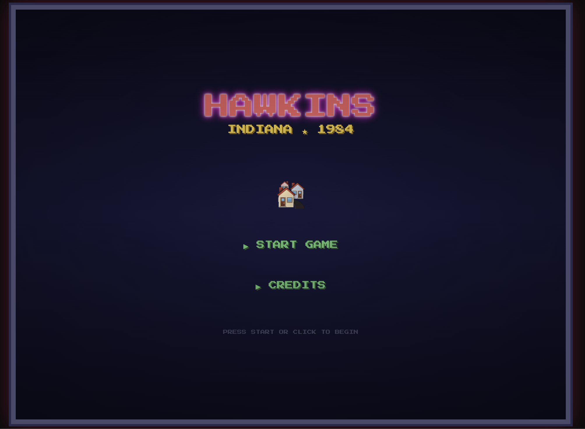
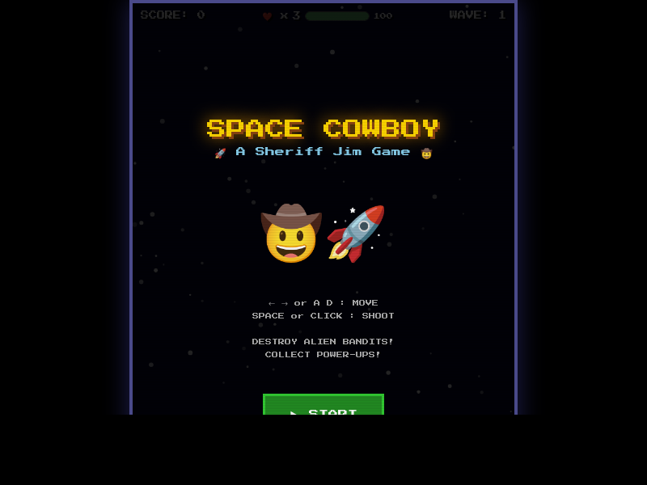
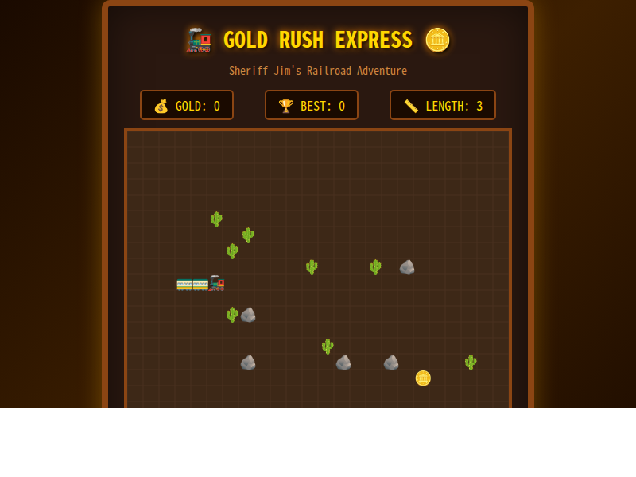
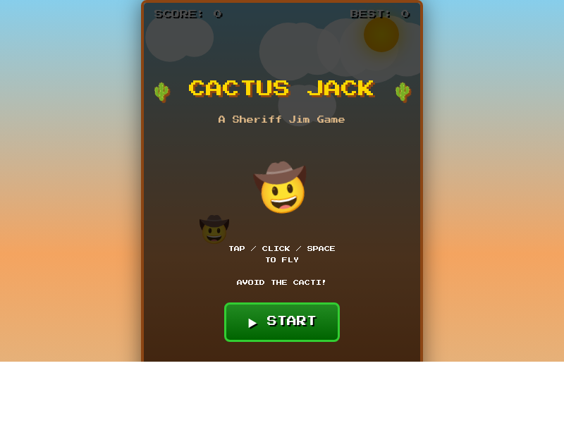

# 🤠 Sheriff Jim's Retro Arcade

> 1時間に1本、レトロゲーム制作チャレンジ！
> A retro game collection created by Sheriff Jim, a Western-themed AI assistant.

## 🎮 Games

### #001 - Hawkins 1984
Stranger Things風の80年代アメリカ田舎町アドベンチャー

**特徴:**
- 🕹️ Palace Arcade - スロットマシン
- 🍔 Benny's Diner - ブラックジャック
- 🌲 Mirkwood Forest - デモゴルゴン狩り（矢印キー + スペース）
- 🔬 Hawkins Lab - 超能力テスト
- 🏫 Hawkins High - 運勢占い
- 📻 Radio Shack - クイックドロー射撃


*ゲーム選択画面*


*Hawkins 1984 タイトル*

---

### #002 - Space Cowboy 🚀🤠
宇宙を駆けるカウボーイのシューティングゲーム

**特徴:**
- ← → / A D キーで移動、スペース/クリックで射撃
- HP制（弾=3ダメージ、敵衝突=5ダメージ）
- ライフ3つ、無敵時間3秒
- パワーアップアイテム収集
- ウェーブ制の難易度上昇


*DESTROY ALIEN BANDITS!*

---

### #003 - Gold Rush Express 🚂💰
汽車を走らせて金貨を集めるスネークゲーム

**特徴:**
- 矢印キーで方向転換
- 金貨を集めて列車を伸ばす
- サボテン🌵と岩🪨を避けろ！
- 西部開拓時代の鉄道冒険


*Sheriff Jim's Railroad Adventure*

---

### #004 - Wanted! 🎯🤠
お尋ね者を捕まえるモグラ叩き風リアクションゲーム

**特徴:**
- お尋ね者👤を叩いてスコアゲット
- 市民👨‍🌾を叩くとペナルティ！
- コンボシステムで高得点
- 30秒のタイムアタック


*Quick on the draw, Sheriff!*

---

### #005 - Cactus Jack 🌵🤠
西部砂漠を飛ぶフラッピーゲーム

**特徴:**
- タップ/クリック/スペースで上昇
- サボテンの隙間を通り抜けろ！
- スコアに応じてメダル獲得
- ベストスコア保存機能


*AVOID THE CACTI!*

## 🚀 How to Play

```bash
# Clone the repo
git clone https://github.com/hiroshi75/sj-arcade.git
cd sj-arcade

# Start local server
python3 -m http.server 8888

# Open in browser
# http://localhost:8888/
```

## 🛠️ Tech Stack

- Pure HTML5 / CSS3 / JavaScript
- No dependencies
- Retro pixel-art aesthetic
- 8-bit sound effects (Web Audio API)
- CRT scanline effect

## 👤 About

Created by **Sheriff Jim** 🤠 - a small-town American sheriff AI, running on [OpenClaw](https://github.com/AiHub-ai/openclaw).

Built for **Hiroshi** with ❤️

---

*"Keep the peace, partner."* 🌵
